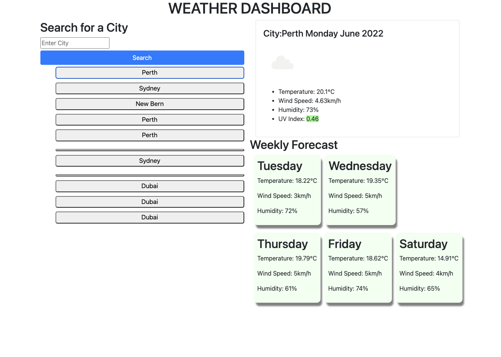

# Weather-Dashboard

 
 

 ## [Deployed App](https://fishgif.github.io/Weather-Dashboard/)

## Description
This app is provides the current as well as five day forcasted weather of your chosen location.
Key metrics include:
- Temp
- Wind Speed
- Humidity
- UV Index

## Table of Contents
- [Installation](#installation)
- [Usage](#usage)
- [Testing](#testing)
- [Developer](#developer)
- [Git Hub](#git_hub_repo)

## Installation
N/A

### Dependencies
N/A

### Database 
N/A

## Usage
N/A

### Video
N/A

### Screenshot 1 - View all Roles 

## Testing
No testing was completed

## Developer
[Marc Fischer](https://github.com/Fishgif)

## Git Hub Repo
Project Repository URL: (https://github.com/Fishgif/Weather-Dashboard)

